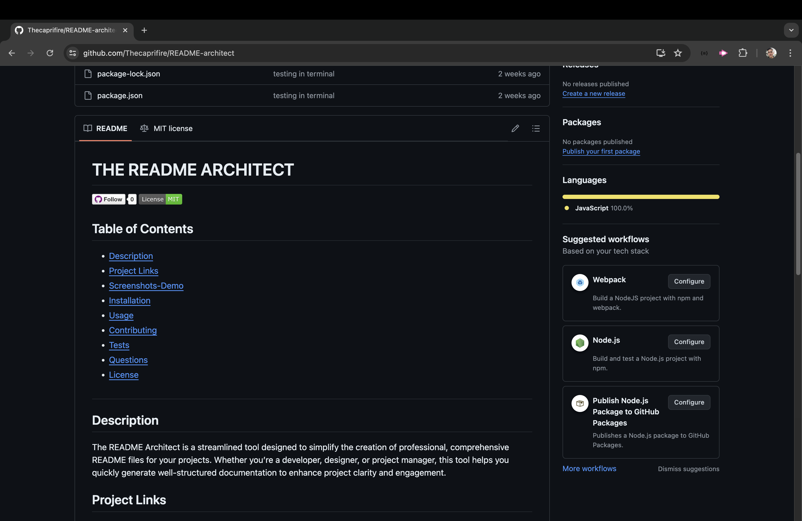

 
  # THE README ARCHITECT

  
  

  ## Table of Contents
  * [Description](#description)
  * [Project Links](#project-links)
  * [Screenshots-Demo](#screenshots-demo)
  * [Installation](#installation)
  * [Usage](#usage)
  * [Contributing](#contributing)
  * [Tests](#tests)
  * [Questions](#questions)
  * [License](#license)
  #

  ## Description
  The README Architect is a streamlined tool designed to simplify the creation of professional, comprehensive README files for your projects. Whether you’re a developer, designer, or project manager, this tool helps you quickly generate well-structured documentation to enhance project clarity and engagement.

  ## Project Links
  https://github.com/thecaprifire/README-architect 
  https://drive.google.com/file/d/1Y_JCoTfhTcByXRkYFxu2Zd4bsfBarOn0/view 
  https://youtu.be/f_-PvQJJDFc?si=j4IIj9hb1FCwc2l2 
  

  ## Screenshots-Demo
  <kbd></kbd>
  
  ## Installation
  Clone the repository link. Open your terminal. Download the inquirer package version 8.2.4. Type in the terminal "node index.js". Provide answers to the prompted questions.

  ## Usage 
  Offers responses to the prompts, and observe your README being created.
  
  ## Contributing
  Check github docs for contributing.

  ## Tests
  npm test

  ## Questions
  Contact the author with any questions! 
  Github link: [thecaprifire](https://github.com/thecaprifire) 
  Email: ianjandaluz@gmail.com

  ## License
  This project is [MIT](https://choosealicense.com/licenses/mit/) licensed. 

  Copyright © 2024 [JAN DALUZ](https://github.com/thecaprifire)
  
  

  
<i>
  Here’s to your coding journey! 🎉 JAN DALUZ
  </i>

  